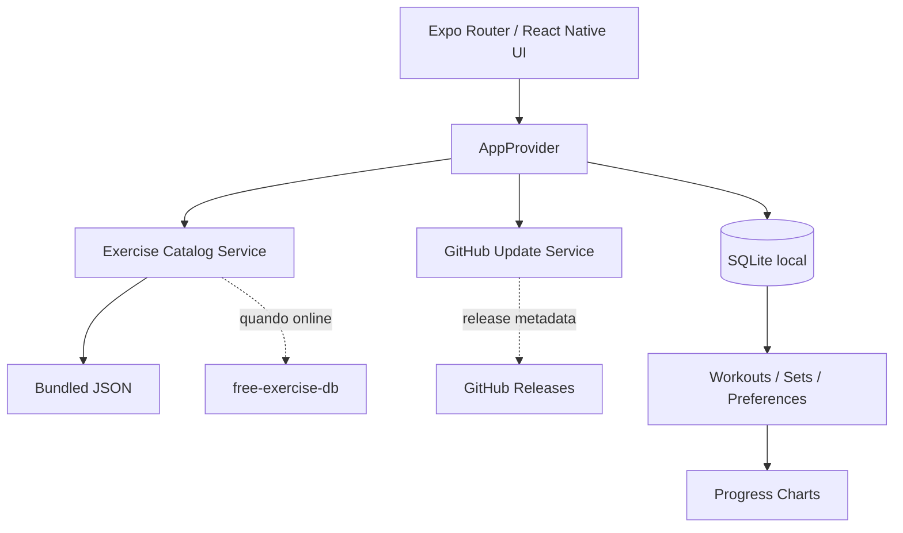

<div align="center">
  <picture>
    <source media="(prefers-color-scheme: dark)" srcset="./assets/branding/neolift-wordmark-light.png" />
    
  </picture>
  <p><strong>Treino offline-first, progresso visual e catálogo aberto de exercícios.</strong></p>

  <p>
    
    
    
    
    
    
  </p>

  <p>
    <a href="#-começando">Começar</a> ·
    <a href="#-experiência">Experiência</a> ·
    <a href="#-arquitetura">Arquitetura</a> ·
    <a href="#-atualizações-pelo-github">Atualizações</a> ·
    <a href="#-release-v120">Release</a>
  </p>
</div>

---

## ✦ O que é

**NeoLift** é um app de treino para Android e iOS criado do zero com React Native + Expo. O catálogo de exercícios é baseado no projeto público **free-exercise-db**, enquanto toda a experiência de treino, persistência, gráficos e interface é própria.

A direção visual mistura interface mobile contemporânea com referências Y2K/anos 2000: superfícies limpas, brilho cromado discreto, azul elétrico/ciano, micro-rótulos técnicos e contraste alto — sem sacrificar legibilidade.

> **Privacidade por padrão:** treino, séries, cargas, favoritos, unidades e preferências ficam no SQLite do aparelho. Não existe conta obrigatória nem backend próprio.

## ✦ Experiência

| Área | O que entrega |
|---|---|
| Início | resumo de treinos, volume semanal, marcas registradas, última sessão e atalho para treino ativo |
| Exercícios | busca por nome/equipamento, filtro muscular, imagem, nível, instruções e favoritos |
| Treino | sessão persistente, exercícios, séries, carga, repetições e conclusão por toque |
| Evolução | gráfico por exercício, gráfico por músculo e painel de regiões do corpo |
| Tema | automático, claro ou escuro com a mesma estrutura visual em Android/iOS |
| Atualização | GitHub Releases, download antecipado no Android e política automática 4+ |
| Catálogo | seed offline + sincronização do catálogo completo do free-exercise-db |

<details>
<summary><strong>Como o gráfico de progressão funciona</strong></summary>

Ao concluir uma série, o app salva a carga e as repetições localmente. Quando o treino é finalizado, esses registros passam a alimentar os gráficos.

Exemplo: se no supino você registrar **5 kg** no início e, duas semanas depois, registrar **10 kg**, o gráfico do exercício mostra a evolução entre as datas. O músculo principal do exercício também alimenta o gráfico daquela região, como **Peitoral**.

O painel de corpo completo acompanha: peitoral, dorsais, costas, ombros, bíceps, tríceps, antebraços, abdômen, lombar, glúteos, quadríceps, posteriores, panturrilhas, adutores, abdutores, trapézio e pescoço.
</details>

<details>
<summary><strong>Offline e sincronização</strong></summary>

O projeto inclui um catálogo inicial para abrir offline. Em desenvolvimento/produção você pode executar `npm run sync:exercises` para empacotar o JSON completo dentro do app. Além disso, quando houver internet, o app tenta atualizar o catálogo público e grava os exercícios no SQLite.

As imagens usam cache em disco via `expo-image`.
</details>

## ✦ Começando

### Requisitos

- Node.js **22.13+**
- npm
- Android Studio para emulador Android, ou dispositivo físico com Expo Go/dev build
- macOS + Xcode para build local de iOS, ou EAS Build

### Instalação

```bash
git clone https://github.com/RaphaelTW/neolift-mobile.git
cd neolift-mobile
npm install
npm run sync:exercises
npx expo start
```

Atalhos:

```bash
npm run android
npm run ios
npm run typecheck
npm run release:check
```

> `npm run sync:exercises` baixa o JSON combinado do free-exercise-db e substitui `assets/data/exercises.full.json`. Se você pular essa etapa, o app continua utilizável com o seed local e tenta sincronizar o catálogo depois.

## ✦ Arquitetura



```text
app/
├── (tabs)/
│   ├── index.tsx          # dashboard
│   ├── exercises.tsx      # catálogo
│   ├── workout.tsx        # entrada do treino
│   ├── progress.tsx       # evolução muscular
│   └── settings.tsx       # tema, unidade, sync, updates
├── exercise/[id].tsx      # detalhe + histórico do exercício
└── workout/session.tsx    # sessão ativa

src/
├── components/            # UI e gráficos
├── context/               # estado e serviços da aplicação
├── db/                    # schema + repository SQLite
├── services/              # catálogo + GitHub updater
├── theme/                 # light/dark
├── types/
└── utils/
```

## ✦ Banco local

O arquivo `neolift.db` contém:

- `settings`
- `exercise_catalog`
- `favorites`
- `workouts`
- `workout_exercises`
- `workout_sets`

Não existe API própria para enviar histórico do usuário.

## ✦ Atualizações pelo GitHub

Na inicialização, o app consulta as **releases estáveis** configuradas em:

```text
EXPO_PUBLIC_GITHUB_OWNER=RaphaelTW
EXPO_PUBLIC_GITHUB_REPO=neolift-mobile
```

O NeoLift conta quantas releases estáveis existem acima da versão instalada:

| Defasagem | Android |
|---|---|
| 1–3 releases | baixa a versão mais recente e pergunta se o usuário deseja instalar agora |
| 4+ releases | baixa automaticamente somente a última versão e abre o instalador do Android |

Drafts e prereleases são ignorados. O APK já baixado é reaproveitado no armazenamento privado do app.

> O Android continua aplicando as regras de segurança do sistema. Em distribuição por APK, o aparelho precisa permitir a fonte de instalação e, no fluxo usado pelo NeoLift, a tela nativa confirma a instalação. Todos os APKs de atualização precisam usar o **mesmo certificado/chave de assinatura** da versão instalada.

- **iOS:** o app detecta a nova release, mas a instalação precisa passar por App Store, TestFlight ou outro canal autorizado pela Apple.

Veja também [`docs/UPDATE_FLOW.md`](./docs/UPDATE_FLOW.md).

## ✦ Build

### Android APK para testes

```bash
npm install -g eas-cli
eas login
eas build -p android --profile preview
```

### Produção

```bash
eas build -p android --profile production
eas build -p ios --profile production
```

## ✦ Release v1.2.0

A v1.2.0 apresenta a nova identidade visual do NeoLift: símbolo ascendente inspirado no monograma **N**, novo ícone do aplicativo, adaptive icon Android, splash e wordmarks para fundos claros e escuros. A versão também consolida a compatibilidade com o Expo SDK 57 e suas dependências nativas.

Consulte [`RELEASE-v1.2.0.md`](./RELEASE-v1.2.0.md) para as notas completas da versão.

<details>
<summary><strong>Checklist antes de uma release</strong></summary>

- [ ] `package.json` e `app.json` estão na mesma versão
- [ ] `android.versionCode` foi incrementado
- [ ] `ios.buildNumber` foi incrementado
- [ ] `npm run release:check` passa
- [ ] `npm run typecheck` passa
- [ ] build Android/iOS testado
- [ ] changelog atualizado
- [ ] tag segue `vX.Y.Z`
- [ ] release do GitHub publicada
- [ ] APK anexado se o canal Android direto for usado
</details>

## ✦ Pesquisa de API sem chave

A v1.1.0 revisou a seção **Sports & Fitness** do `public-apis/public-apis`. A API específica de workout/exercícios listada ali é a **Wger**, porém o catálogo a marca como dependente de `apiKey`. As opções sem autenticação são voltadas principalmente a resultados esportivos, ligas, bicicletas e locais, não a um catálogo de musculação.

Por isso o NeoLift continua com o `free-exercise-db` como fonte principal sem chave e com fallback offline. A análise está em [`docs/API_RESEARCH.md`](./docs/API_RESEARCH.md).

## ✦ Fonte dos exercícios

Dados e caminhos de imagens vêm de [`yuhonas/free-exercise-db`](https://github.com/yuhonas/free-exercise-db), projeto publicado sob **Unlicense / domínio público**. O projeto NeoLift mantém um aviso separado em [`THIRD_PARTY_NOTICES.md`](./THIRD_PARTY_NOTICES.md).

## ✦ Licença

Código do NeoLift: **MIT**. Consulte [`LICENSE`](./LICENSE).
