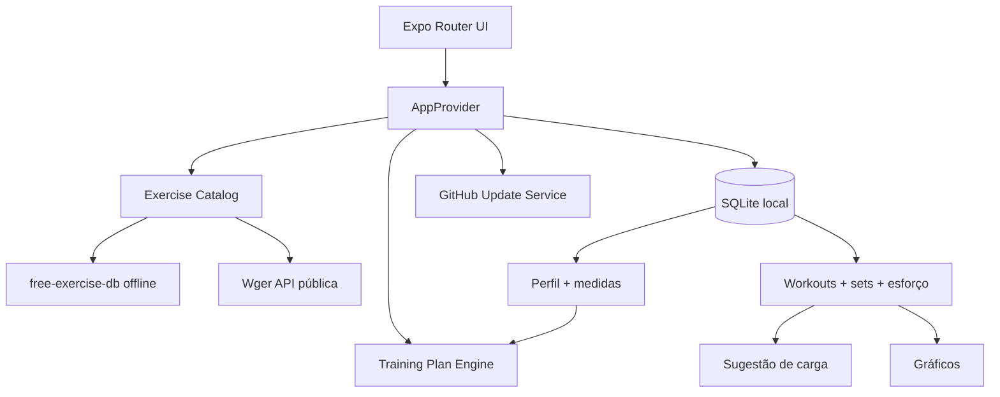

## 🌐 Biblioteca híbrida: offline + Wger

A v1.5.0 mantém o `free-exercise-db` como base local e adiciona sincronização opcional com os **endpoints públicos de exercícios do Wger**, que podem ser lidos sem conta/API key.

- exercícios novos do Wger entram no SQLite como `wger:<id>`;
- nomes equivalentes enriquecem o exercício offline e viram `hybrid`;
- imagens e vídeos Wger são usados quando disponíveis;
- vídeo toca dentro do NeoLift usando `expo-video`;
- o Exercise Coach 3D continua funcionando como fallback offline;
- fonte, autor e licença são preservados no catálogo.

A sincronização fica em **Configurações → Catálogo → Wger Open Exercise Library**. Perfil, medidas e histórico de treino não são enviados ao Wger. Veja [`docs/WGER_INTEGRATION.md`](docs/WGER_INTEGRATION.md).

<div align="center">
  <picture>
    <source media="(prefers-color-scheme: dark)" srcset="./assets/branding/neolift-wordmark-light.png" />
    
  </picture>

  <p><strong>Treino adaptativo, evolução de carga e acompanhamento corporal — offline-first.</strong></p>

  <p>
    
    
    
    
  </p>
</div>

## NeoLift

Aplicativo React Native + Expo para Android e iOS. O catálogo usa o `free-exercise-db`; perfil, treinos, medidas, séries, cargas, progresso e preferências ficam no SQLite do aparelho.

A v1.5.0 mantém a identidade roxa, o tema claro e o preto fosco, preserva o **Exercise Coach 3D** e adiciona uma biblioteca híbrida com exercícios e mídias públicas do Wger.

<details>
<summary><strong>O que existe nesta versão</strong></summary>

- onboarding com sexo, idade, peso, nível, foco e dias semanais;
- Iniciante, Intermediário e Avançado / profissional;
- objetivos: Emagrecer, Ganhar massa muscular e Ganhar peso e massa;
- plano semanal e rotação mensal de exercícios;
- semanas de Base, Volume, Progressão e Consolidação;
- sugestão de carga baseada no histórico;
- feedback de esforço: Sobrou / Ideal / Pesou;
- histórico detalhado de treinos;
- gráficos por exercício e grupo muscular;
- peso e medidas corporais por data;
- temas Sistema, Claro e Escuro;
- GitHub Releases + política Android de atualização 4+;
- Exercise Coach com escolha 3D offline ou vídeo Wger dentro do app quando disponível;
- sincronização pública do Wger sem conta/API key para leitura;
- catálogo híbrido e filtros por fonte;
- avatar 3D procedural com pausa, velocidade e três ângulos de câmera;
- alertas/confirmacões com o mesmo visual do app.

</details>


## Exercise Coach 3D

Ao tocar em **Como fazer**, o NeoLift oferece vídeo interno quando houver mídia oficial Wger. Sem vídeo interno, abre diretamente a opção 3D.

```text
Como quer ver o exercício?

[ Assistir vídeo interno ]  // quando disponível
[ Ver animação 3D ]
[ Agora não ]
```

O 3D é renderizado no aparelho e funciona offline. Em vez de empacotar centenas de arquivos pesados, um avatar procedural é animado por famílias biomecânicas, cobrindo todo o catálogo inclusive exercícios adicionados no futuro por meio de um fallback genérico.

Quando a sincronização Wger encontra um vídeo oficial para o exercício, ele é reproduzido **dentro do NeoLift** com `expo-video`. Não há busca no YouTube nem abertura de navegador. Sem vídeo ou internet, o NeoLift mantém a demonstração 3D, as instruções e uma imagem local de fallback.

Todo exercício possui representação visual: imagens específicas dos catálogos têm prioridade e o asset local otimizado `assets/exercise-fallback.webp` cobre mídia ausente ou falha de carregamento, inclusive durante a sessão ativa.

Detalhes em [`docs/EXERCISE_COACH.md`](docs/EXERCISE_COACH.md) e a validação de cobertura em [`docs/COACH_COVERAGE.md`](docs/COACH_COVERAGE.md).

## Motor de recomendação

A primeira carga é sempre escolhida pelo usuário. Depois de concluir sessões, o app usa a carga registrada e o feedback do exercício para sugerir uma próxima carga conservadora.

```text
Pesou                      -> ~ -5%
Ideal                      -> manter
Sobrou uma vez             -> ~ +2,5%
Sobrou duas vezes seguidas -> ~ +5%
```

A sugestão pode ser ignorada a qualquer momento.

O planejamento mensal é explicado em [`docs/TRAINING_ENGINE.md`](docs/TRAINING_ENGINE.md).

## Arquitetura



```text
app/
├── (tabs)/
│   ├── index.tsx          # dashboard
│   ├── exercises.tsx      # catálogo
│   ├── workout.tsx        # plano semanal/mensal
│   ├── progress.tsx       # carga + corpo
│   └── settings.tsx       # perfil e ajustes
├── onboarding.tsx
├── profile/
│   ├── edit.tsx
│   └── measurements.tsx
└── workout/
    ├── session.tsx
    └── history.tsx
```

## Rodar o projeto

```bash
npm install
npm run sync:exercises
npx expo start
```

Android:

```bash
npm run android
```

iOS:

```bash
npm run ios
```

Validação:

```bash
npm ci
npm run typecheck
npm run release:check
npm run security:check
npx expo-doctor
```

## Build APK

Instale e autentique o EAS CLI:

```bash
npm install -g eas-cli
eas login
```

Gere APK interno:

```bash
eas build -p android --profile preview
```

O perfil `preview` em `eas.json` usa `buildType: apk`.
As versões são lidas localmente do `app.json` por meio de `cli.appVersionSource: local`.

## Publicar v1.5.0

```bash
git add .
git commit -m "feat(catalog): integra biblioteca pública do Wger" -m "Adiciona sincronização híbrida de exercícios, imagens e vídeos Wger sem autenticação, player de vídeo interno, atribuição de licenças e filtros por fonte, preservando a base offline e o Exercise Coach 3D."
git push origin main

git tag -a v1.5.0 -m "NeoLift v1.5.0 — Open Exercise Library"
git push origin v1.5.0

gh release create v1.5.0 --title "NeoLift v1.5.0 — Open Exercise Library" --notes-file RELEASE-v1.5.0.md
```

Depois do EAS Build, baixe o APK, renomeie para `NeoLift-v1.5.0.apk` e anexe:

```bash
gh release upload v1.5.0 ./NeoLift-v1.5.0.apk --clobber
```

## Atualização Android

O app lista releases estáveis do GitHub. Com 1–3 releases novas, baixa a mais recente e pergunta se o usuário quer instalar. Com 4+ releases novas, baixa a última e abre o instalador automaticamente. A confirmação final continua pertencendo ao Android.

## Dados e privacidade

Não existe conta obrigatória. O app guarda localmente:

- perfil;
- peso e circunferências;
- treinos;
- séries, repetições e cargas;
- feedback de esforço;
- favoritos e preferências.

## Catálogo

A base principal é `yuhonas/free-exercise-db`; o Wger é uma segunda fonte pública opcional. O catálogo offline pode ser empacotado com:

```bash
npm run sync:exercises
```

## Versão

**NeoLift v1.5.0 — Open Exercise Library**
