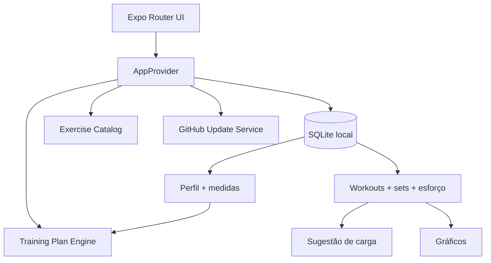

<div align="center">
  <picture>
    <source media="(prefers-color-scheme: dark)" srcset="./assets/branding/neolift-wordmark-light.png" />
    
  </picture>

  <p><strong>Treino adaptativo, evolução de carga e acompanhamento corporal — offline-first.</strong></p>

  <p>
    
    
    
    
  </p>
</div>

## NeoLift

Aplicativo React Native + Expo para Android e iOS. O catálogo usa o `free-exercise-db`; perfil, treinos, medidas, séries, cargas, progresso e preferências ficam no SQLite do aparelho.

A v1.4.0 mantém a identidade roxa, o tema claro e o preto fosco e adiciona o **Exercise Coach**: demonstração 3D offline para todo o catálogo, vídeo online contextual e diálogos totalmente integrados ao visual NeoLift.

<details>
<summary><strong>O que existe nesta versão</strong></summary>

- onboarding com sexo, idade, peso, nível, foco e dias semanais;
- Iniciante, Intermediário e Avançado / profissional;
- objetivos: Emagrecer, Ganhar massa muscular e Ganhar peso e massa;
- plano semanal e rotação mensal de exercícios;
- semanas de Base, Volume, Progressão e Consolidação;
- sugestão de carga baseada no histórico;
- feedback de esforço: Sobrou / Ideal / Pesou;
- histórico detalhado de treinos;
- gráficos por exercício e grupo muscular;
- peso e medidas corporais por data;
- temas Sistema, Claro e Escuro;
- GitHub Releases + política Android de atualização 4+;
- Exercise Coach com escolha 3D offline ou vídeo online;
- avatar 3D procedural com pausa, velocidade e três ângulos de câmera;
- alertas/confirmacões com o mesmo visual do app.

</details>


## Exercise Coach 3D

Ao tocar em **Como fazer**, o NeoLift pergunta se o usuário quer **ver em 3D** ou **ver em vídeo**.

```text
Como quer ver o exercício?

[ Ver exemplo em 3D ]
[ Ver exemplo em vídeo ]
[ Agora não ]
```

O 3D é renderizado no aparelho e funciona offline. Em vez de empacotar centenas de arquivos pesados, um avatar procedural é animado por famílias biomecânicas, cobrindo todo o catálogo inclusive exercícios adicionados no futuro por meio de um fallback genérico.

O vídeo usa internet e abre uma busca contextual pelo nome do exercício no navegador integrado. Não exige API key. Se a pessoa estiver offline, o NeoLift exibe um diálogo temático oferecendo imediatamente o modo 3D.

Detalhes em [`docs/EXERCISE_COACH.md`](docs/EXERCISE_COACH.md) e a validação de cobertura em [`docs/COACH_COVERAGE.md`](docs/COACH_COVERAGE.md).

## Motor de recomendação

A primeira carga é sempre escolhida pelo usuário. Depois de concluir sessões, o app usa a carga registrada e o feedback do exercício para sugerir uma próxima carga conservadora.

```text
Pesou                      -> ~ -5%
Ideal                      -> manter
Sobrou uma vez             -> ~ +2,5%
Sobrou duas vezes seguidas -> ~ +5%
```

A sugestão pode ser ignorada a qualquer momento.

O planejamento mensal é explicado em [`docs/TRAINING_ENGINE.md`](docs/TRAINING_ENGINE.md).

## Arquitetura



```text
app/
├── (tabs)/
│   ├── index.tsx          # dashboard
│   ├── exercises.tsx      # catálogo
│   ├── workout.tsx        # plano semanal/mensal
│   ├── progress.tsx       # carga + corpo
│   └── settings.tsx       # perfil e ajustes
├── onboarding.tsx
├── profile/
│   ├── edit.tsx
│   └── measurements.tsx
└── workout/
    ├── session.tsx
    └── history.tsx
```

## Rodar o projeto

```bash
npm install
npm run sync:exercises
npx expo start
```

Android:

```bash
npm run android
```

iOS:

```bash
npm run ios
```

Validação:

```bash
npm run typecheck
npm run release:check
```

## Build APK

Instale e autentique o EAS CLI:

```bash
npm install -g eas-cli
eas login
```

Gere APK interno:

```bash
eas build -p android --profile preview
```

O perfil `preview` em `eas.json` usa `buildType: apk`.

## Publicar v1.4.0

```bash
git add .
git commit -m "feat(coach): adiciona demonstrações 3D e vídeos de execução" -m "Cria Exercise Coach com avatar 3D offline para todo o catálogo, escolha entre 3D e vídeo online e substitui alertas nativos por diálogos com a identidade visual NeoLift."
git push origin main

git tag -a v1.4.0 -m "NeoLift v1.4.0 — Exercise Coach 3D"
git push origin v1.4.0

gh release create v1.4.0 --title "NeoLift v1.4.0 — Exercise Coach 3D" --notes-file RELEASE-v1.4.0.md
```

Depois do EAS Build, baixe o APK, renomeie para `NeoLift-v1.4.0.apk` e anexe:

```bash
gh release upload v1.4.0 ./NeoLift-v1.4.0.apk --clobber
```

## Atualização Android

O app lista releases estáveis do GitHub. Com 1–3 releases novas, baixa a mais recente e pergunta se o usuário quer instalar. Com 4+ releases novas, baixa a última e abre o instalador automaticamente. A confirmação final continua pertencendo ao Android.

## Dados e privacidade

Não existe conta obrigatória. O app guarda localmente:

- perfil;
- peso e circunferências;
- treinos;
- séries, repetições e cargas;
- feedback de esforço;
- favoritos e preferências.

## Catálogo

Fonte: `yuhonas/free-exercise-db`. O catálogo pode ser empacotado com:

```bash
npm run sync:exercises
```

## Versão

**NeoLift v1.4.0 — Exercise Coach 3D**
